# BEDU_ML
## :rocket:  Proyecto: Clasificación de riesgo crediticio
**Curso de Ciencia de Datos, BEDU**   
*Mauro Santiago*
  

  
---
  
## :capital_abcd: Introducción

Este proyecto está basado en el reto *German Credit Risk* disponible en la plataforma [Kaggle](https://www.kaggle.com/uciml/german-credit).
Este proyecto incluye un conjuntos de datos:

- German_credit_data

## Contexto

El Datase contiene 1,000 entradas con 20 categorías. Estos datos fueron preparados por el Prof. Hofmann. En este, cada entrada representa a una persona que recibe un crédito de un banco. Cada persona se clasifica como riesgo crediticio bueno o malo según el conjunto de atributos. El enlace al conjunto de datos original se puede encontrar a continuación

## Contenido

El Dataset original es muy complicado de trabajar debido a su complicado sistema de categorías y símbolos , por tal motivo se trabajó con una Dataset previamente modificado por un tercero. Link[     ]

Los atributos con los que se van a trabajar son :

- Age (Variable numérica en años de los clietes) 
- Sex (Variable categórica)
- - Categorías: (masculino, femenino)
- Job (Variable categórica) 
- - Categorías numéricas: 0 - no calificado y no residente, 1 - no calificado y residente, 2 - calificado, 3 - altamente calificado
- Housing (Variable categórica)
- - Categorías: (own, rent, free)
- Saving accounts (Variable categórica) 
- - Categorías: (little, moderate, quite rich, rich)
- Checking account (Varieble numérica en DM (Deutsch Mark/Marco Alemán)
- Credit amount (Variable numérica en DM )
- Duration (Variable numérica en meses)
- Purpose (Variable categórica)
- - Categorías: (car, furniture/equipment, radio/TV, domestic appliances, repairs, education, business, vacation/others)

Variable Objetivo 

- Risk (Variable categórica)
- - Categorías: (good, bad)

### :dart: Objetivos y Tareas
---
​
Con ayuda de __Python__ sobre su herramienta __Jupyter Notebooks__ se ealizarán las siguients tareas:

- Carga de datos usando `pandas`
- Análisis exploratorio de datos
- Labores de predicción
- Clasificación
- etc.

-  Con la varile objetivo `Risk`se van a evaluar diferentes tipos de modelos de regresión y clasificación con el fin de poder predecir el perfil de riesgo de nuevos clientes.
 
---
​
## :ballot_box_with_check: Carga y preprocesamiento de datos
  
**Carga de datos**

Con  __Jupyter Notebooks__  y el uso de `pandas` se carga el Dataset `scored_data`.

**Preprocesamiento 1**
- [scored_data_bin.csv](Datasets/scored_data_bin.csv)

1. Los datos `saving_accounts` y `checking_account` presentan valores `Nan` los cuanles se cambian a no una string de `no_info `, para poder trabajar con los datos.
2. Se utiliza `LabelBinarizer` y `LabelEncoder` de  `sklearn.preprocessing` para procesar los datos categoricos a numerícos.
3. Se guarda el archivo.


**Preprocesamiento 2**
- [scored_data_all_bin.csv](Datasets/scored_data_all_bin.csv)

1. La variables numericas (`age`, `duration`, `credit_amount`) se trasforman a numericas.
2. Con `get_dummies` se transforman los datos a binarios.
3. Se guarda el archivo.

[Notebook](German_CR/Procesamiento.ipynb)


---

## :ballot_box_with_check: Exploratorio 


<details><summary><strong>Edad </em></strong> </summary>
	<p>
    
- La edad promedio es 35.5 años
- La edad minima es de 19 años
- La edad maxima es de 75 años 
- El Rango de edad es 56 años 
- El 25% de los datos tienen un valor menor a 27
- El 50% de los datos tienen un valor menor a 33 (mediana)
- El 75% de los datos tienen un valor menor a 42
- Rango intercuartilico: 15
- La desviación estándar es 11.37 (Los datos muy unidos)


  
- Los datos estan centrandos de lado izquierdo, podriamos decir que los créditos estan mas disponibles para los jovenes.
- Los clientes mayores de 60 años son atipicos 
- Los clientes se concentran en una edad de 25 a 40 años 
  
## Con filtro de poco riesgo y alto riesgo. 
  


- Los clientes grandes son atipicos en los dos casos 
- Los clientes con mayor riesgo son mas jovenes
- La distribución de las edades de los clientes son similares en los dos casos (good/bad).
    
</p>
</details>

<details><summary><strong>Tiempo del crédito solícitado  (duration) </em></strong> </summary>
	<p>
    
- El promedio la duración del crédito  es 20.90 meses 
- La duración minima solicitada es de 4 meses
- La duración maximo solicitada es de 72 meses
- El Rango de la duración del crédito es de 68
- El 25% de los datos tienen un valor menor a 12.00
- El 50% de los datos tienen un valor menor a 18.00 (mediana)
- El 75% de los datos tienen un valor menor a 24.00
- Rango intercuartilico: 12 
- La desviación estándar es 12.058 (Los datos no son dispersos)
    


</p>
</details>

<details><summary><strong>Monto de crédito (credit_amount) </em></strong> </summary>
	<p>
    
- El promedio del monto de los créditos es 3,271.25
- El monto minimo solicitado es de 250.00
- EL monto maximo solicitado es de 18,424.00
- El Rango de los montos de credito es de 18,174.00
- El 25% de los datos tienen un valor menor a 13,65.50
- El 50% de los datos tienen un valor menor a 2,319.50 (mediana)
- El 75% de los datos tienen un valor menor a 3,972.25
- Rango intercuartilico: 2,606.75
- La desviación estándar es 2,822.73 (Los datos son muy dispersos)
 

  
- Crédito arriba de 7,500 son raros
- Los montos de crétos mas solicitados estan entre 2,500  y 3,500 
- Los créditos de mayor monto son para pocos clientes
  
 
</p>
</details>

<details><summary><strong>Modas (credit_amount) </em></strong> </summary>
	<p>
     

  
- La mayoria de los clietes son de 27 años siento tambien la mayoria de los clientes de poco riesgo
- la mayoria de los clietes tienen trabajo de tipo 2 (En general y en clasificacion de cliente)
- la mayoria de los clietes cuenta con pocos ahorros (En general y en clasificacion de cliente)
- la mayoria de los clietes usan el crédito para comprar un automovil (En general y en clasificacion de cliente)
 
</p>
</details>

</p>
</details>

<details><summary><strong>Crosstab </em></strong> </summary>
	<p>
     
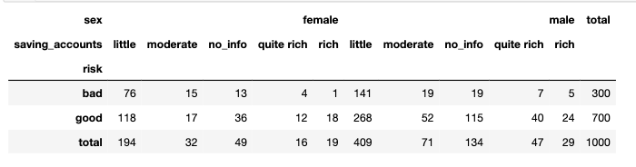

- En este caso en ambos casos los clientes con una cuenta pequeña de ahorros tienen un perfil de alto riesgo.
- Los hombres tienen a mayor tendencia a tener un perfil de alto riesgo.
	
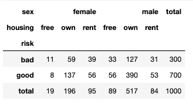

- Los clientes con casa propia son los que tienen la mayoria de los casos de alto riesgo en ambos casos (Masculinos y femeninos) , esto podría no ser un indicador optimo, ya que esto nos indica nada as que el cliente tiene propiedades a su nombre y no su calidad como pagador a sus deudas.
	
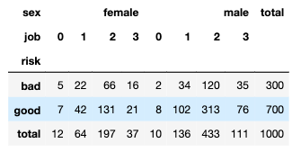

- Los clientes con el trabajo tipo 2 sin importar si es femenino o masculino tienen la mayor cantidad de clientes de perfil de alto riesgo

</p>
</details>

[Notebook](German_CR/01_Exploratorio.ipynb)
---
## :ballot_box_with_check: Clasificación.


Para realizar el entrenamiento con todos los modelos se siguieron los siguientes pasos:

1. Como datos de entrada se eligieron todos los campos menos la columna que nos indica el estado de riesgo del cliente.

1. Como dato de salida se eligió únicamente el estado de riesgo de cliente.

1. Separar el conjunto de datos en entrenamiento y prueba (70%/30%).

1. Realizar el entrenamiento.

Para analizar los resultados se usó una matriz de confusión.

- Una interpretación de los resultados de esta matriz, se puede dar mediante las siguientes fórmulas:

    1. Precisión.
   
   __precision__ = VP / (VP + FP)

    2. Exactitud.
   
   __exactitud__ = (VP + VN) / (VP + FN + FP + VN)

    3. Sensibilidad.
   
   __sensibilidad__ = VP / (VP + FN)

    4. Especificidad: De todas las clasificaciones negativas que había en realidad, ¿cuántas fueron clasificadas correctamente como negativas?
   
   __especificidad__ = VN / (VN + FP)
   
 ## Clasificación Supervisada ##
 
 <details><summary><strong>Árboles de Decisión </em></strong> </summary>
	<p>
	
- Proceso de datos numero 1
	
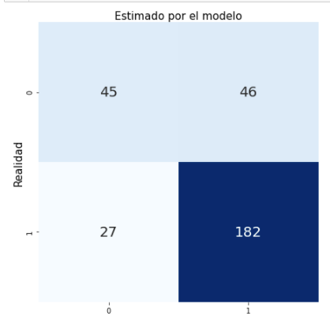
	
```
Precision: 79.82%
Exactitud: 75.67%
Sensibilidad: 87.08%
Especificidad: 49.45%
```	
La precision, exactitud y sensibilida son altos, nos unduca que el modelo ayuda a predecir a los clientes con un peril de bajo riesgo `good` con una especifidad moderada. EL modelo clasifica bien los casos `good` y moderadamente bien los clientes de mucho riesgo.
	
- Proceso de datos numero 2
	
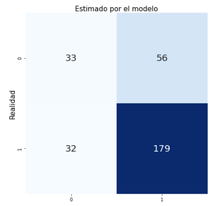
	
```
Precision: 76.17%
Exactitud: 70.67%
Sensibilidad: 84.83%
Especificidad: 37.08%
```	
El segundo procesamiento de datos de comportan muy igual, solo que en este la especificidad baja un poco. Este modelo no ayuda a claisificar a los clietes de alto riesgo.
	
[Notebook](German_CR/01_Exploratorio.ipynb)
  
</p>
</details>

 <details><summary><strong>Naïve Bayes  </em></strong> </summary>
	<p>
	
- Proceso de datos numero 1
	
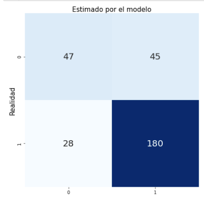

```
Precision: 80.0%
Exactitud: 75.67%
Sensibilidad: 86.54%
Especificidad: 51.09&
```

Los datos se comportan similar con el árbol mejorado un poco las métricas. 
	
- Proceso de datos numero 2
	
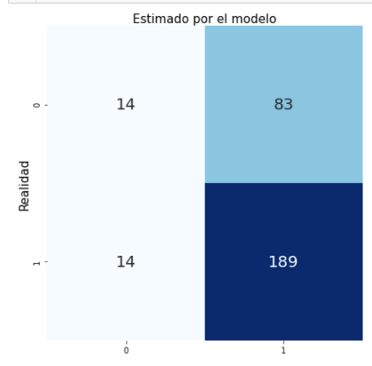

```
Precision: 69.49%
Exactitud: 67.67%
Sensibilidad: 93.1%
Especificidad: 14.43&
```	
	
El modelo nos ayuda a detectar a clientes de perfl bajo de riesgo pero no ayuda a clasificar a los clientes de alto riesgo.
	
[Notebook](German_CR/naive_bayes.ipynb.ipynb)
  	
</p>
</details>

 <details><summary><strong>Regresión logística   </em></strong> </summary>
	<p>
	
- Proceso de datos numero 1
	
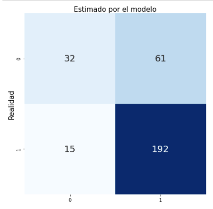
	
```
Precision: 75.89%
Exactitud: 74.67%
Sensibilidad: 92.75%
Especificidad: 34.41%
```	
El modelo mejora en la forma en claisificar a los clientes de poco riesgo 
	
- Proceso de datos numero 2
	
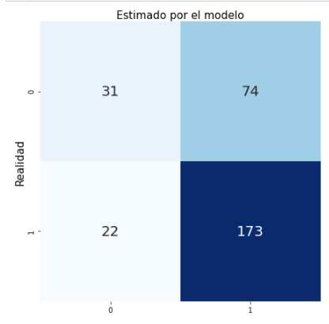

```
Precision: 81.93%
Exactitud: 74.0%
Sensibilidad: 84.78%
Especificidad: 38.57%
```	
EL modelo, con el segundo procesaiento de datos, mejoro bastante la forma en que puede describir a los clientes con poco reisgo crediticio
	
	
[Notebook](German_CR/LogisticRegression.ipynb.ipynb.ipynb)

	
</p>
</details>

 ## Clasificación No Supervisada ##
 
 <details><summary><strong>K-Means  </em></strong> </summary>
	<p>
	
- Proceso de datos numero 1
	
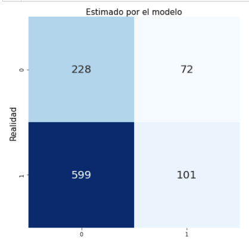
	
```
Precision: 58.38%
Exactitud: 32.9%
Sensibilidad: 14.43%
Especificidad: 76.0%
```

El modelo nos ayuda a clasificar a los clientes con alto riesgo `bad` con el primer procesamiento de datos
	
- Proceso de datos numero 2
	
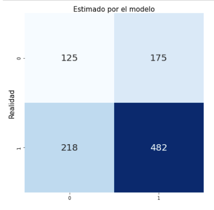

```
Precision: 73.36%
Exactitud: 60.7%
Sensibilidad: 68.86%
Especificidad: 41.67%
```

Con este modelo y procesamiento de datos el modelo describe muy bien los dos casos. `good` y `bad`

[Notebook](German_CR/kmeans.ipynb.ipynb.ipynb)
  
	
</p>
</details>

---

## :ballot_box_with_check: Trabajo a futuro
  
<Describir tareas pendientes que pueden ayudar a mejorar los resultados.>
	
-Trabajar con el dataset original para poder procesar la información de forma diferente y comparar resultados. 
- Estudiar funciona de los los algoritmos ML (aplicaciones) 
- Completar el dataset con  más información de clientes con riesgo alto, ya que se tienen nada mas 300 registros de 1000 clientes. 
- Trabajar con dataset de restaurante de comida de alitas y hamburguesas (segudo proyecto) 
  
