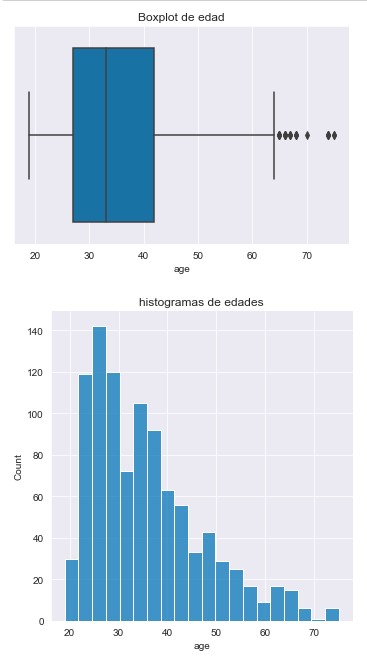
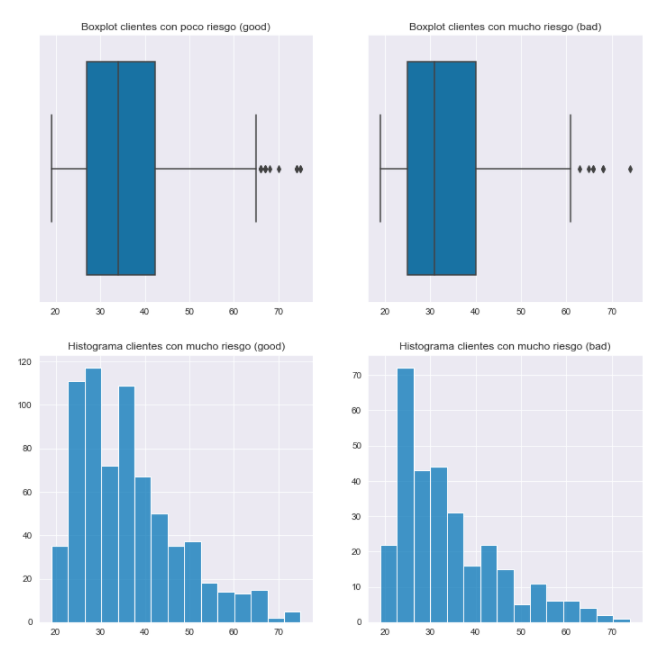
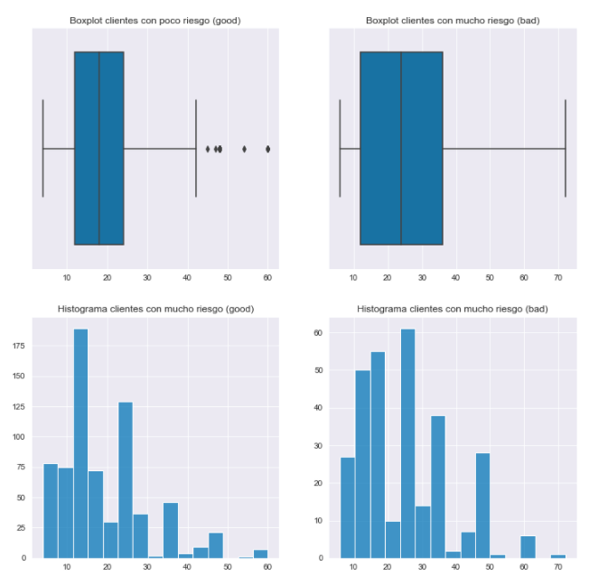
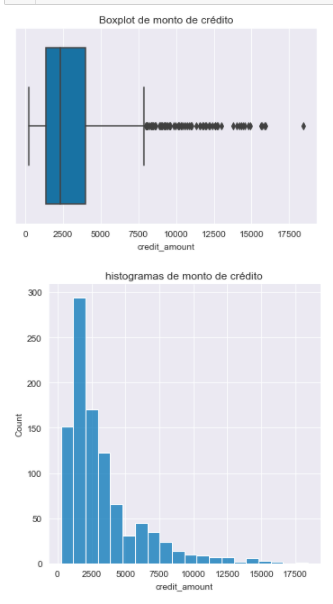
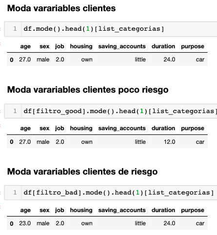

# BEDU_ML
## :rocket:  Proyecto: Clasificación de riesgo crediticio
**Curso de Ciencia de Datos, BEDU**   
*Mauro Santiago*
  

  
---
  
## :capital_abcd: Introducción

Este proyecto está basado en el reto *German Credit Risk* disponible en la plataforma [Kaggle](https://www.kaggle.com/uciml/german-credit).
Este proyecto incluye un conjuntos de datos:

- German_credit_data

## Contexto

El Datase contiene 1,000 entradas con 20 categorías. Estos datos fueron preparados por el Prof. Hofmann. En este, cada entrada representa a una persona que recibe un crédito de un banco. Cada persona se clasifica como riesgo crediticio bueno o malo según el conjunto de atributos. El enlace al conjunto de datos original se puede encontrar a continuación

## Contenido

El Dataset original es muy complicado de trabajar debido a su complicado sistema de categorías y símbolos , por tal motivo se trabajó con una Dataset previamente modificado por un tercero. Link[     ]

Los atributos con los que se van a trabajar son :

- Age (Variable numérica en años de los clietes) 
- Sex (Variable categórica)
- - Categorías: (masculino, femenino)
- Job (Variable categórica) 
- - Categorías numéricas: 0 - no calificado y no residente, 1 - no calificado y residente, 2 - calificado, 3 - altamente calificado
- Housing (Variable categórica)
- - Categorías: (own, rent, free)
- Saving accounts (Variable categórica) 
- - Categorías: (little, moderate, quite rich, rich)
- Checking account (Varieble numérica en DM (Deutsch Mark/Marco Alemán)
- Credit amount (Variable numérica en DM )
- Duration (Variable numérica en meses)
- Purpose (Variable categórica)
- - Categorías: (car, furniture/equipment, radio/TV, domestic appliances, repairs, education, business, vacation/others)

Variable Objetivo 

- Risk (Variable categórica)
- - Categorías: (good, bad)

### :dart: Objetivos y Tareas
---
​
Con ayuda de __Python__ sobre su herramienta __Jupyter Notebooks__ se ealizarán las siguients tareas:

- Carga de datos usando `pandas`
- Análisis exploratorio de datos
- Labores de predicción
- Clasificación
- etc.

-  Con la varile objetivo `Risk`se van a evaluar diferentes tipos de modelos de regresión y clasificación con el fin de poder predecir el perfil de riesgo de nuevos clientes.
 
---
​
## :ballot_box_with_check: Carga y preprocesamiento de datos
  
**Carga de datos**

Con  __Jupyter Notebooks__  y el uso de `pandas` se carga el Dataset `scored_data`.

**Preprocesamiento 1**
- [scored_data_bin.csv](Datasets/scored_data_bin.csv)

1. Los datos `saving_accounts` y `checking_account` presentan valores `Nan` los cuanles se cambian a no una string de `no_info `, para poder trabajar con los datos.
2. Se utiliza `LabelBinarizer` y `LabelEncoder` de  `sklearn.preprocessing` para procesar los datos categoricos a numerícos.
3. Se guarda el archivo.

**Preprocesamiento 2**
- [scored_data_all_bin.csv](Datasets/scored_data_all_bin.csv)

1. La variables numericas (`age`, `duration`, `credit_amount`) se trasforman a numericas.
2. Con `get_dummies` se transforman los datos a binarios.
3. Se guarda el archivo.

[Notebook](German_CR/Procesamiento.ipynb)

---

## :ballot_box_with_check: Exploratorio 

<strong>Edad </em></strong> 

	

    
- La edad promedio es 35.5 años
- La edad minima es de 19 años
- La edad maxima es de 75 años 
- El Rango de edad es 56 años 
- El 25% de los datos tienen un valor menor a 27
- El 50% de los datos tienen un valor menor a 33 (mediana)
- El 75% de los datos tienen un valor menor a 42
- Rango intercuartilico: 15
- La desviación estándar es 11.37 (Los datos muy unidos)

  
- Los datos estan centrandos de lado izquierdo, podriamos decir que los créditos estan mas disponibles para los jovenes.
- Los clientes mayores de 60 años son atipicos 
- Los clientes se concentran en una edad de 25 a 40 años 
  
## Con filtro de poco riesgo y alto riesgo. 
  

- Los clientes grandes son atipicos en los dos casos 
- Los clientes con mayor riesgo son mas jovenes
- La distribución de las edades de los clientes son similares en los dos casos (good/bad).
    

<strong>Tiempo del crédito solícitado  (duration) </em></strong> 

	

    
- El promedio la duración del crédito  es 20.90 meses 
- La duración minima solicitada es de 4 meses
- La duración maximo solicitada es de 72 meses
- El Rango de la duración del crédito es de 68
- El 25% de los datos tienen un valor menor a 12.00
- El 50% de los datos tienen un valor menor a 18.00 (mediana)
- El 75% de los datos tienen un valor menor a 24.00
- Rango intercuartilico: 12 
- La desviación estándar es 12.058 (Los datos no son dispersos)
    

<strong>Monto de crédito (credit_amount) </em></strong> 

	

    
- El promedio del monto de los créditos es 3,271.25
- El monto minimo solicitado es de 250.00
- EL monto maximo solicitado es de 18,424.00
- El Rango de los montos de credito es de 18,174.00
- El 25% de los datos tienen un valor menor a 13,65.50
- El 50% de los datos tienen un valor menor a 2,319.50 (mediana)
- El 75% de los datos tienen un valor menor a 3,972.25
- Rango intercuartilico: 2,606.75
- La desviación estándar es 2,822.73 (Los datos son muy dispersos)
 

  
- Crédito arriba de 7,500 son raros
- Los montos de crétos mas solicitados estan entre 2,500  y 3,500 
- Los créditos de mayor monto son para pocos clientes
  
 

<strong>Modas (credit_amount) </em></strong> 

	

     

  
- La mayoria de los clietes son de 27 años siento tambien la mayoria de los clientes de poco riesgo
- la mayoria de los clietes tienen trabajo de tipo 2 (En general y en clasificacion de cliente)
- la mayoria de los clietes cuenta con pocos ahorros (En general y en clasificacion de cliente)
- la mayoria de los clietes usan el crédito para comprar un automovil (En general y en clasificacion de cliente)
 

  
## :ballot_box_with_check: Trabajo a futuro
  
<Describir tareas pendientes que pueden ayudar a mejorar los resultados.>
  
